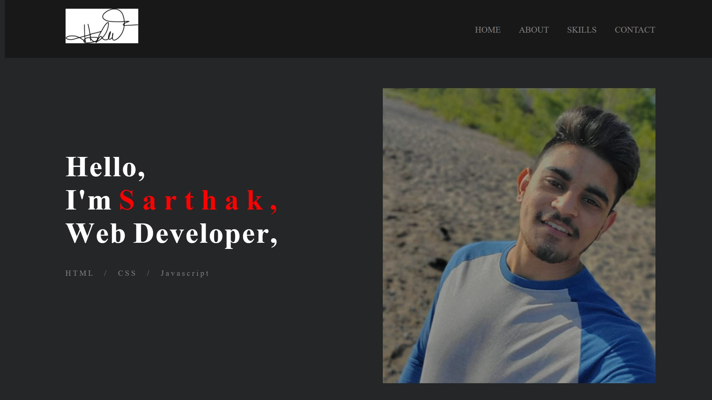

# PORTFOLIO

> FRONT END WEB DEVELOPER
---
### Table of contents

- [Description](#description)
- [References](#references)
- [Author](#author)

---

## Description

This is my portfolio piece. It is assigned as my course Final Integrated Project fall, 2020. This is my identity where i have displayed my work and skills.  

[Roadmap (steps followed for this project)](https://docs.google.com/document/d/1RdNh4iCbtOzZASNZpXU6q0sla9PBC0DufmcRBZzn1U4/edit)

### Technologies 

Following are the softwares which i have used to designed elements of portfolio and langauages that are used for coding:

- Git bash
- Visual Studio Code
- Photoshop
- illustrator
- Adobe XD
- Adobe InDesign
- HTML
- CSS
- Javascript
- SASS
- AJAX
- Vue
- SQL, MYSQL
- PHP

---

## References
- W3schools
- youtube
- MDN learning

---

## Author

Sarthak Shah

